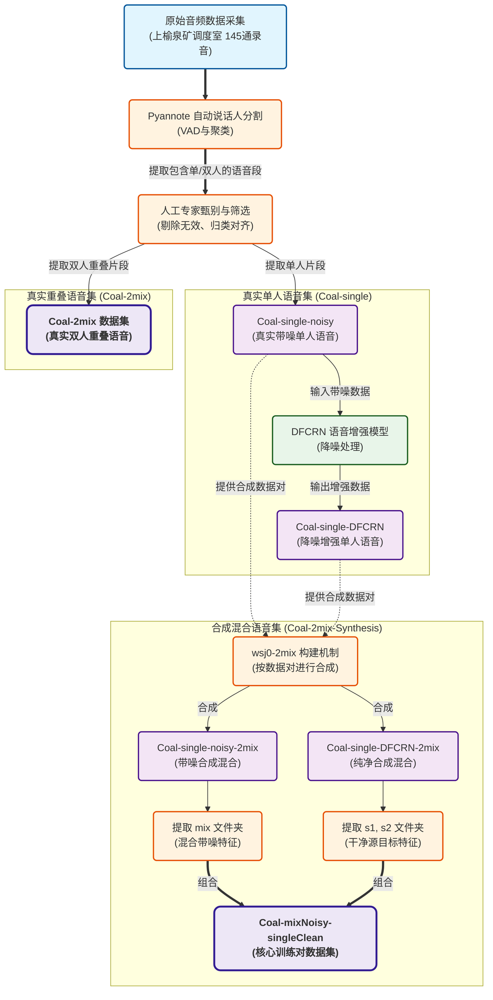

## Feature Analysis of Overlapping Speech in Coal Mine Production Scheduling Scenarios


---

# 🚀 Uploading Like There's No Tomorrow

> ⚠️ **WARNING:** This project is still uploading. The author is currently battling slow Wi-Fi, existential dread, and mysterious bugs. Stay tuned. Don't rush.

---

## 🧠 What is this?

It’s a project that’s still halfway through uploading, but already aiming for the stars.
Could be code. Could be a model. Might even be a thesis draft wrapped in duct tape.
The files, the features, the occasional meltdown—all coming soon™.

## 🐢 Current Status

* [x] Renamed files at 3 AM
* [x] Uploaded the 999th `.pt` checkpoint manually
* [ ] Finished writing this README
* [ ] Upload complete (someday)
* [ ] Paper done (don’t ask)

## 🌪 Author's Condition

```bash
Status: Uploading...
ETA: Unknown
Stability: Questionable
Wi-Fi: Holding on for dear life
```

## 🧊 To Future Me (or You)

If you're reading this, it means the upload was successful.
Or I've collapsed somewhere, and my computer finished the job.
Either way—drop a ⭐️ to honor this heroic struggle against the void.

## 🎁 Easter Egg?

Maybe. When it’s all done. Maybe.

---

> **Uploading is hard. Reading is easy. Appreciate this moment.**
> — A human trying to sync their soul to GitHub

---

